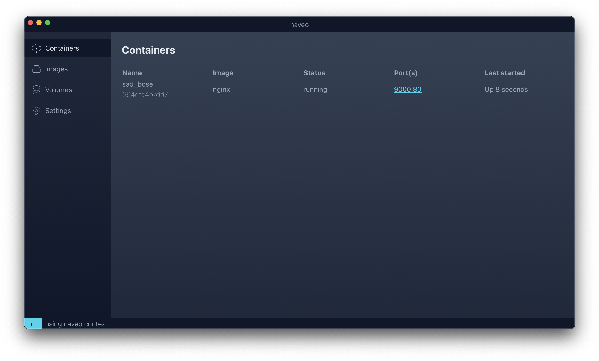

# naveo releases

## naveo is a free and open source Docker Desktop alternative for macOS

### A screenshot of naveo's GUI for managing containers:

### naveo's key features:

- Easy to install and use.
- Compatible with Docker, using docker cli.
- Automatic network ports forwarding.
- Automatic file sharing between macOS and containers.
- A built-in GUI for managing containers.
- Automatic app update.
- Completely free and open source.
